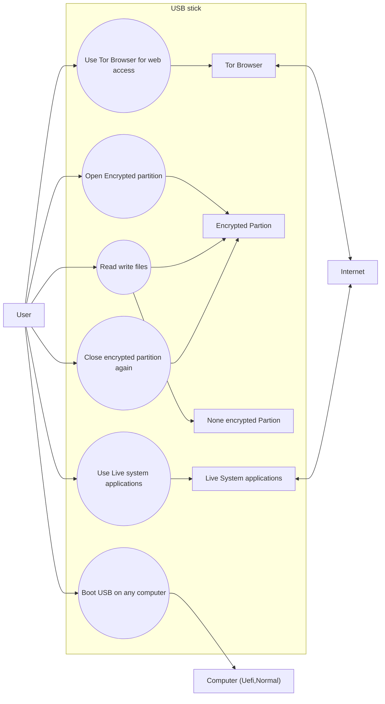
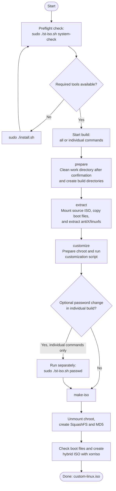

# How to use the USB stick

This document shows the typical workflow for a USB stick prepared with a bootable live system and a separate encrypted data partition.

## Use case overview



## Preparing the USB stick

Build the custom ISO with `st-iso.sh` as described below in ISO section. Then write it to a USB drive with:

```bash
sudo ./st-usb.sh \
  --usb-drive /dev/sdX \
  --iso ./custom-linux.iso \
  --sizes 15,20,5 \
  all
```

Replace `/dev/sdX` with the correct USB device. The deployment script erases the selected drive, so verify the device path carefully before running it.

## Typical usage flow

1. Boot the prepared USB stick on a computer.
2. Start the live system (**systemd** variant) and log in.
3. Open the encrypted data partition with the password.
4. Copy or work on files that should stay protected.
5. Use the Tor Browser for anonymous or restricted browsing.
6. If needed, save data to the unencrypted partition for regular files.
7. After finishing the work, close the encrypted partition again.
8. Remove the USB stick safely.

## Important note

The encrypted partition is meant for sensitive files. It should only stay open while actively in use, and it should be closed again after the work is done.

## Example workflow

```text
User
  -> boots USB stick
  -> opens encrypted partition
  -> uses Tor Browser or other Applications
  -> stores non-sensitive files on the unencrypted partition
  -> closes encrypted partition
  -> removes USB stick safely
```

## Practical rule

- Sensitive data: encrypted partition
- Temporary or public data: unencrypted partition
- Always close the encrypted partition after use

This keeps the secure storage protected while still allowing a simple file transfer workflow on the unencrypted side.

## Open encrypted partion

After login use the `open_crypt` starter or open the terminal and type in

```bash
st_crypt.sh open
```

## Close encrypted partion
After login use the `close_crypt` starter or open the terminal and type in

```bash
st_crypt close
```

# How to prepare a ISO

## ISO build workflow



The command sequence implemented by `st-iso.sh` is:

```text
system-check
prepare
extract
customize
make-iso
```

`all` runs `prepare`, `extract`, `customize`, and `make-iso` in sequence. The optional `passwd` step is not included and can only be run separately before `make-iso` when building with individual commands.


`prepare` already performs the cleaning step and creates the required working directories. Therefore, the complete build can also be started with:

```bash
sudo ./st-iso.sh all
```

The command `all` executes the following actions in this order:

1. `prepare` creates the working tree and deletes an existing work directory after confirmation.
2. `extract` mounts the source ISO, copies its files into the build area, and extracts the embedded Linux filesystem.
3. `customize` prepares the chroot and applies the live-system customization scripts.
4. `make-iso` rebuilds the SquashFS filesystem and creates the final hybrid-bootable ISO.

Not include in the `all` set is `passwd`. This must be called seperatly.

## Step descriptions

### 1. Check the required system tools

Run the check separately before starting a build:

```bash
sudo ./st-iso.sh system-check
```

The script verifies that `sudo`, `rsync`, `xorriso`, and `unsquashfs` are available. It also requires that the command is executed as root. The required packages are normally installed by running:

```bash
sudo ./install.sh
```

### 2. Clean and prepare the build tree

```bash
sudo ./st-iso.sh prepare
```

`prepare` performs the following actions:

- Deletes the current work directory after asking for confirmation.
- Cleans up any mounted filesystems inside that directory.
- Creates the `chroot` and `image` directories.
- Creates the `mnt` directory when the source ISO is extracted.

> The command name `prepare` includes the cleanup operation. Calling `clean` separately is only needed when you want to remove the existing work directory without starting the build.

### 3. Extract the source ISO

```bash
sudo ./st-iso.sh extract
```

The script:

1. Creates the mount directory for the source ISO.
2. Mounts the selected source ISO in loopback mode.
3. Copies all files from the source ISO into `work/image`, except the embedded `antiX/linuxfs` image.
4. Extracts `antiX/linuxfs` into `work/chroot` with `unsquashfs`.
5. Unmounts the source ISO.

The default source is `./MX-25_Xfce_x64.iso`. A different source can be selected with:

```bash
sudo ./st-iso.sh \
  --iso /path/to/source.iso \
  extract
```

### 4. Customize the live system

```bash
sudo ./st-iso.sh customize
```

The customization step prepares the chroot and applies the configured customization script. It mounts the required chroot filesystems, copies `/etc/resolv.conf`, and then runs the customization logic from `sh_ext_mx/customize_tor_browser.sh`.

The current customization changes include:

- Keyboard configuration.
- LightDM configuration.
- Decryption and USB live-mount support.
- Package installation settings.
- Removal of the MX welcome and installer desktop entries.
- Desktop configuration for the Tor Browser launcher.

The custom script can be replaced with another script using:

```bash
sudo ./st-iso.sh \
  --customize-script /path/to/customize.sh \
  customize
```

### 5. Optional: open an interactive chroot shell

```bash
sudo ./st-iso.sh shell
```

This step mounts the chroot filesystem interfaces when necessary and starts an interactive Bash shell inside `work/chroot`. Use it to inspect or manually change the live filesystem. Leave the shell with `exit` before creating the final ISO.

### 6. Optional: change the demo-user password

```bash
sudo ./st-iso.sh passwd
```

This command runs the password-setting script inside the extracted chroot and starts the `passwd demo` command. The password is requested interactively. Run this step before `make-iso` if the demo user should receive a new password.

The password script can be replaced with another script using:

```bash
sudo ./st-iso.sh \
  --passwd-script /path/to/passwd-script.sh \
  passwd
```

### 7. Create the SquashFS image and final ISO

```bash
sudo ./st-iso.sh make-iso
```

This step performs both packaging actions:

1. Unmounts the temporary chroot filesystems.
2. Removes the previous `work/image/antiX/linuxfs` file.
3. Creates a new compressed SquashFS image with `mksquashfs` using XZ compression.
4. Creates `work/image/antiX/linuxfs.md5` containing the resulting filesystem checksum.
5. Verifies that the required boot files exist.
6. Locates `isohdpfx.bin` from the installed Syslinux files.
7. Creates the hybrid-bootable ISO with `xorriso` and writes it to `custom-linux.iso` by default.

The output path can be changed with:

```bash
sudo ./st-iso.sh \
  --iso-output /path/to/output.iso \
  make-iso
```

The final ISO is a hybrid boot image with BIOS/UEFI boot support and uses the boot files from the extracted live system.

## Complete build example

The following command builds the ISO using the default paths:

```bash
sudo ./st-iso.sh \
  --iso ./MX-25_Xfce_x64.iso \
  --workdir ./work \
  --iso-output ./custom-linux.iso \
  all
```

The `all` command performs the same sequence as `prepare`, `extract`, `customize`, and `make-iso`. The optional `shell` and `passwd` commands are not included in `all`; run them separately when needed.

## Working directories

The build uses the following folders under the selected work directory (default):

- `work/mnt` — temporary mount point for the source ISO.
- `work/chroot` — extracted live root filesystem that receives customization changes.
- `work/image` — rebuilt content containing the boot files and the new SquashFS image.

The script removes the work directory when the process finishes, except for the generated ISO and the files that are intentionally retained in the selected output location.
