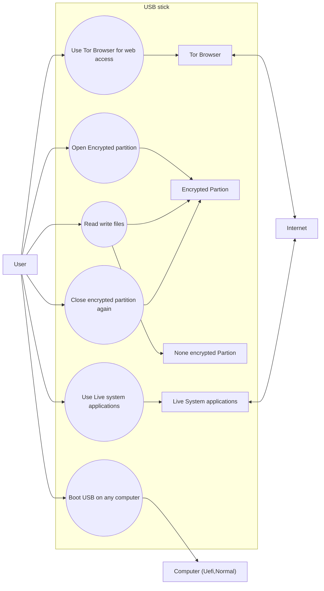

# How to use the USB stick

This document shows the typical workflow for a USB stick prepared with a bootable live system and a separate encrypted data partition.

## Use case overview



## Typical usage flow

1. Boot the prepared USB stick on a computer.
2. Start the live system and log in.
3. Open the encrypted data partition with the password.
4. Copy or work on files that should stay protected.
5. Use the Tor Browser for anonymous or restricted browsing.
6. If needed, save data to the unencrypted partition for regular files.
7. After finishing the work, close the encrypted partition again.
8. Remove the USB stick safely.

## Important note

The encrypted partition is meant for sensitive files. It should only stay open while actively in use, and it should be closed again after the work is done.

## Example workflow

```text
User
  -> boots USB stick
  -> opens encrypted partition
  -> uses Tor Browser or other Applications
  -> stores non-sensitive files on the unencrypted partition
  -> closes encrypted partition
  -> removes USB stick safely
```

## Practical rule

- Sensitive data: encrypted partition
- Temporary or public data: unencrypted partition
- Always close the encrypted partition after use

This keeps the secure storage protected while still allowing a simple file transfer workflow on the unencrypted side.
